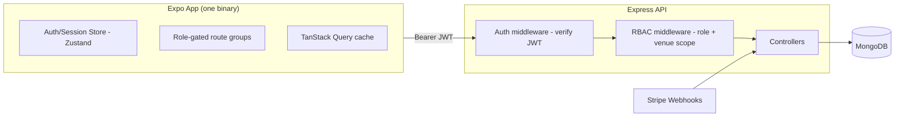

# Design Doc - Restaurant Membership Club App

**Stack:** Expo React Native single app with role-based access control, Express, MongoDB, Stripe, JWT

## 1. System Overview

One Expo binary ships to all four user types. The user role determines what renders and which routes are reachable client-side. The server is the only place permission is actually enforced; client RBAC is for UX, not security.



## 2. RBAC Model

Roles:

- `member`: discover venues, redeem perks, manage subscription.
- `restaurant_staff`: scan and confirm redemptions for assigned venues.
- `restaurant_owner`: staff permissions plus venue, offer, staff, and analytics management.
- `admin`: global management, approvals, users, fraud monitoring.

Server-side permissions are enforced by auth middleware, RBAC middleware, and venue-scoped DB checks. The client only hides irrelevant routes and UI.

Use a `VenueStaff` join collection instead of embedding venue IDs on users. It supports many-to-many venue membership, restaurant groups, and per-venue role overrides.

## 3. Brand Identity

Working name: **Round**.

The product vocabulary should use "rounds" instead of generic credits or tokens. Examples:

- "Start this round"
- "This round's on the house"
- "That's 5 for the week - see you Monday"
- "Already had a round here this week - try somewhere new"
- "No rounds yet - go find something good"

Trademark status is unchecked.

### Visual System

Signature mark: a thick partial ring. It represents a coaster or glass rim, a weekly reset clock, and a progress dial. In-product, it also becomes the live rounds-remaining widget.

Color tokens:

| Token | Hex | Role |
| --- | --- | --- |
| `bg.base` | `#16151A` | App background |
| `bg.surface` | `#221F24` | Cards, sheets |
| `accent.primary` | `#D98B4A` | CTAs, active states, ring mark |
| `accent.alert` | `#7A2E3A` | Blackout windows, destructive actions, low-balance states |
| `text.primary` | `#F2EDE6` | Primary text |
| `text.muted` | `#9C948C` | Secondary text |

Typography:

- Display: Fraunces for venue names, screen titles, and wordmark.
- Body/UI: Inter or General Sans for lists, buttons, forms, and functional text.
- Data: Space Mono for membership number, PINs, and timers.

Surface rules:

- Dark mode only at launch.
- No drop shadows.
- Use 1px warm hairline borders.
- Cards: 16px radius.
- Buttons: 12px radius.
- Avatars and ring mark: fully round.

Photography direction: low-light interiors, bars, dining rooms, glassware, and ambiance. Avoid flat-lay food photography and generic corporate dining stock.

## 4. Client Design Guide

Use Expo Router with role route groups:

```text
app/
  (auth)/
    login.tsx
    signup.tsx
  (member)/
    _layout.tsx
    index.tsx
    venue/[id].tsx
    redeem/[redemptionId].tsx
    history.tsx
    profile.tsx
  (staff)/
    _layout.tsx
    scanner.tsx
    manual-entry.tsx
    log.tsx
  (owner)/
    _layout.tsx
    venue-editor.tsx
    offers.tsx
    analytics.tsx
    staff.tsx
  (admin)/
    _layout.tsx
    venues-queue.tsx
    users.tsx
    redemptions.tsx
src/
  components/
  hooks/
  stores/
  services/
  theme/
```

State:

- TanStack Query for server state.
- Zustand for session/client state.
- Access token in memory only.
- Refresh token in `expo-secure-store`.

## 5. Server Design Guide

Server structure:

```text
src/
  config/
  models/
  middleware/
  routes/
  controllers/
  services/
  utils/
server.js
```

Core models:

- `User`
- `Venue`
- `VenueStaff`
- `Redemption`
- `RefreshToken`

Critical redemption constraint:

```js
redemptionSchema.index(
  { userId: 1, venueId: 1, periodKey: 1 },
  { unique: true, partialFilterExpression: { status: { $in: ['initiated', 'confirmed'] } } }
);
```

The database unique index must enforce one redemption per venue per period. Do not rely only on application-level checks.

## 6. Failure Modes

| Failure mode | Mitigation |
| --- | --- |
| Double redemption | Unique compound DB index |
| Client-only RBAC bypass | Server middleware on every protected route |
| QR replay | 90-second signed, single-use token |
| GPS spoofing | Soft fraud signal, not hard access control |
| Stale staff access | DB re-check on mutating venue routes |
| Stale subscription state | Server re-reads subscription from DB |
| Refresh token theft | Rotation and reuse detection |

## 7. Open Decisions

1. Geofence radius: recommend soft-flag only for MVP.
2. Staff multi-venue: recommend shipping `VenueStaff` in v1.
3. Working name: "Round" needs trademark checking before public launch.
4. PIN expiry: proposed 90 seconds, same as QR.
